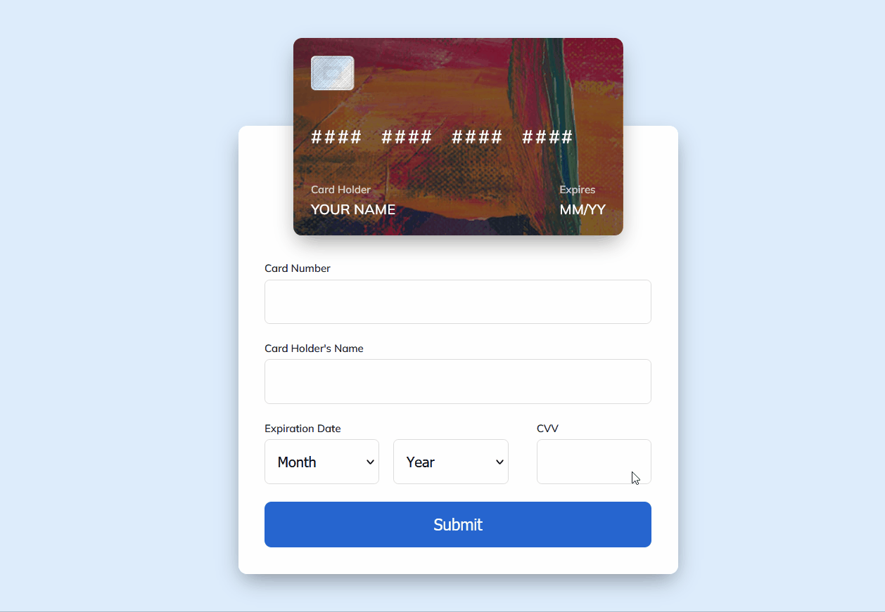

  

<a
          class="cc-link"
          href="https://animated-cc-form.netlify.app/"
          target="_blank"
          rel="noopener noreferrer"
          >
  <b>💳 Animated Credit Card Form</b>
          </a
        >

## What is it about?

This project is a simple demonstration of an animated credit card form. It's made using

- **HTML**, **CSS**, **JS**
- **[anime.js](https://github.com/juliangarnier/anime)** - for animations
- **[Rollup Starter App](https://github.com/rollup/rollup-starter-app)** - for bundling and some peace of mind

Check it out by clicking [here](https://animated-cc-form.netlify.app/)

Feel free to open any issues and contribute to this project. Cheers :beers:
